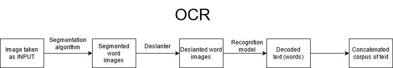
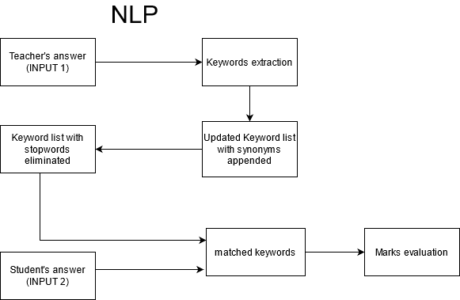
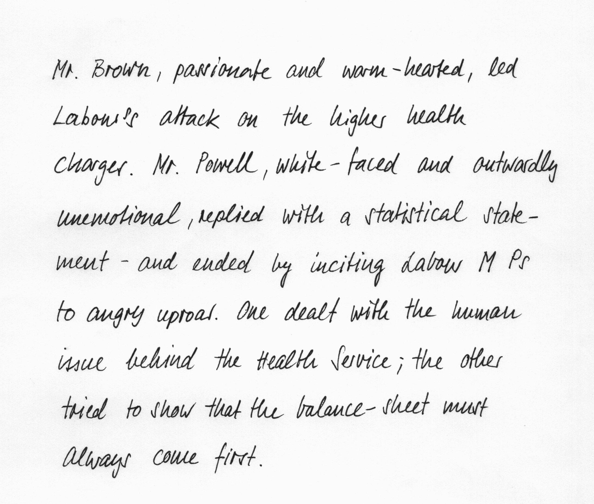
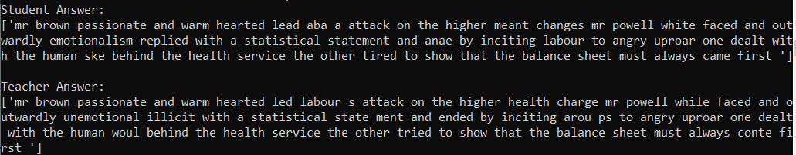
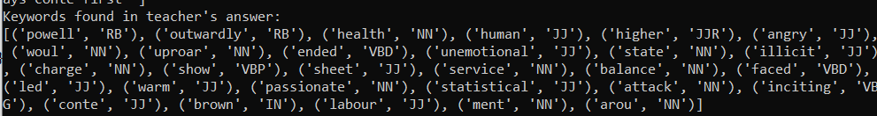
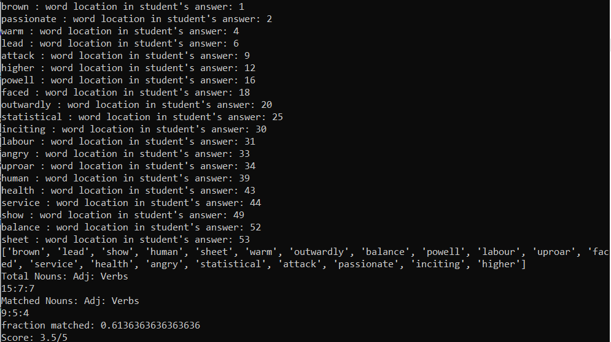
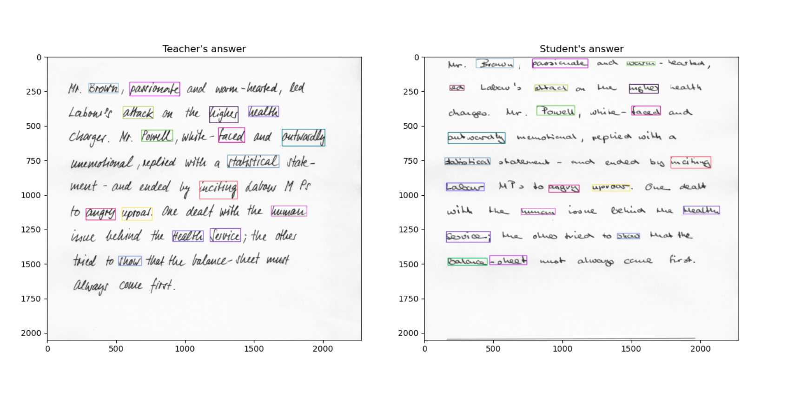

# HandEval, an automated Handwritten-answer Evaluator

The objective of the project is to approach development in Automated grading/evaluation of  the  Handwritten  Answers  presented  by  a  student. Evaluation takes place using a reference answer provided by the teacher whether in text form or the image of handwritten text. 

The project can be divided into 2 parts namely OCR (Optical Character Recognition) and NLP(Natural Language Processing).

### OCR 
  

## NLP
  

## Run demo
 
* Go to the `src` directory 
* Run inference code:
  * Execute `python main.py --student_answer_image PATH_TO_STUDENT_ANSWER_IMAGE --teacher_answer_image PATH_TO_STUDENT_ANSWER_IMAGE --marks MARKS` to run the model on those images
  * Execute `python main.py --student_answer_text STRING_CONTAINING_STUDENT_ANSWER --teacher_answer_text STRING_CONTAINING_TEACHER_ANSWER --marks MARKS` if text is already decoded to run the model on the text 

## Command line arguments
* `--student_answer_image`: the path to the image with handwritten student answer
* `--teacher_answer_image`: the path to the image with handwritten teacher(reference) answer
* `--student_answer_text`: a string containing student answer
* `--teacher_answer_text`: a string containing teacher(reference) answer
* `--marks`: (Required) an integer denoting maximum marks alloted to the question

The input images and results shown below.

### Input images:

Teacher's Answer           |  Student's Answer
:-------------------------:|:-------------------------:
  |  

Recognised Text           |  Keywords found in Teacher's Answer
:-------------------------:|:-------------------------:
 |  

### Matched Keywords' Location and Marks Evaluation

### Original Images with highlighted matched keywords

## Information about model

The Recognition model consists of 5 CNN layers, 2 RNN (LSTM) layers and the CTC loss and decoding layer. The decoder used is Word Beam search. 

## References
* [Handwritten Recognition model](https://github.com/githubharald/SimpleHTR)
* [Deslanter](https://github.com/githubharald/DeslantImg)
* [Word Beam Search Decoder](https://github.com/githubharald/CTCWordBeamSearch)
* [Scheidl - Handwritten Text Recognition in Historical Documents](https://repositum.tuwien.ac.at/obvutwhs/download/pdf/2874742)
* [Scheidl - Word Beam Search: A Connectionist Temporal Classification Decoding Algorithm](https://repositum.tuwien.ac.at/obvutwoa/download/pdf/2774578)

